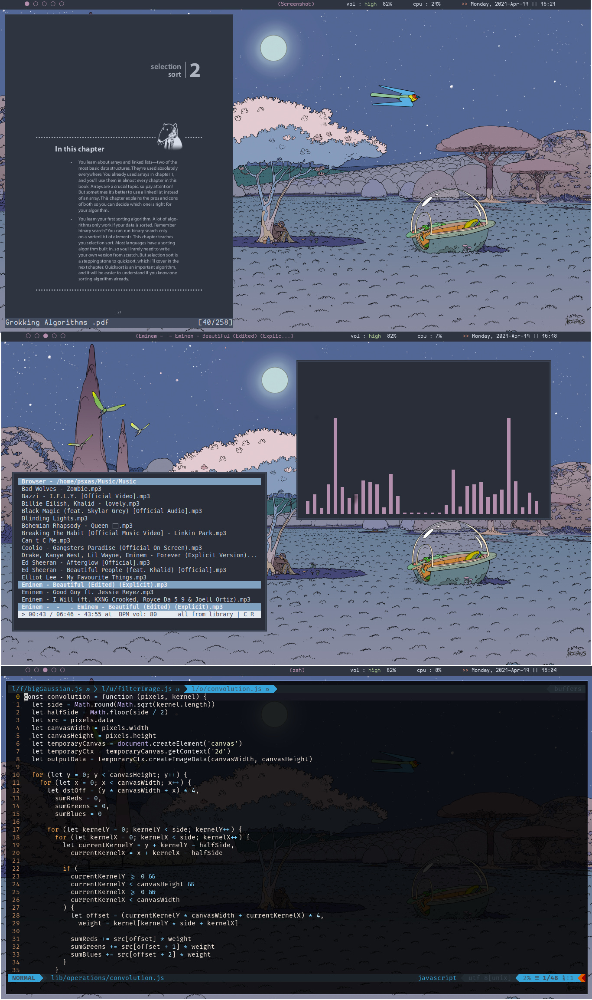

# DOT FILES

#### Dependencies : kitty, polybar, tint2, rofi

## Awesome config
It was made from copy cat config. looks okay.
To make it work:
            
            cd dotfiles
            cp ./awesome ~/.config/

#### notes.sh
A script for note taking in vim and terminal.

Setup:   
      check if the file is made executable or not. If not mark it executable   
      
      Paste it inside usr/local/bin.

That's it for running in terminal 
For running in vim             
      
      add a key bind for !notes.sh

I am sure this not the best script but i made it and works fine so i have no problems with it

## init.vim

Nvim setup that i use for programming

#### Xresources for URXVT

paste file in home directory and then run
            
            xrdb ~/.Xresources

#### Other things to install and do
- [ ] In bashrc make alias for nvim
- [ ] Install nvm
- [ ] Install fortune 
- [ ] Install chromium
- [ ] Install Rofi and switch to android notification theme
- [ ] Install CMUS & tty-clock
- [ ] Install kitty terminal

## Openbox 

**FOR SETTING Openbox**
1. paste files in .config
2. Download openbox themes from [here](https://github.com/addy-dclxvi/openbox-theme-collections)
3. install tint2 
4. paste tint2 folder in .config

## Herbstluftwm 

**FOR SETTING herbstluftwm**
1. paste files in .config
2. Download polybar

###### Todo
- [x] add more rice for awesome (one with power arrow theme)
- [x] ~~nvim config instead of .vimrc~~
