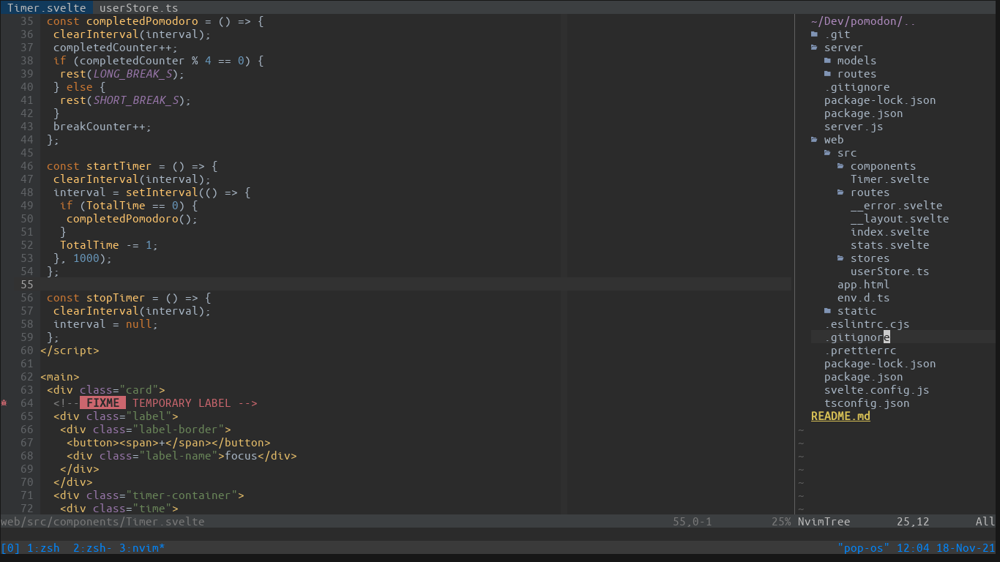

# DOTFILES

This has my nvim, tmux and i3 configurations.

# For a new setup

Install following stuff:

- nvim (0.5+)
- i3
- zsh
- lazygit
- bat
- tmux
- starship
- vscode
- [fira-code patched by nerd fonts](https://www.nerdfonts.com/font-downloads)

yup that's it
